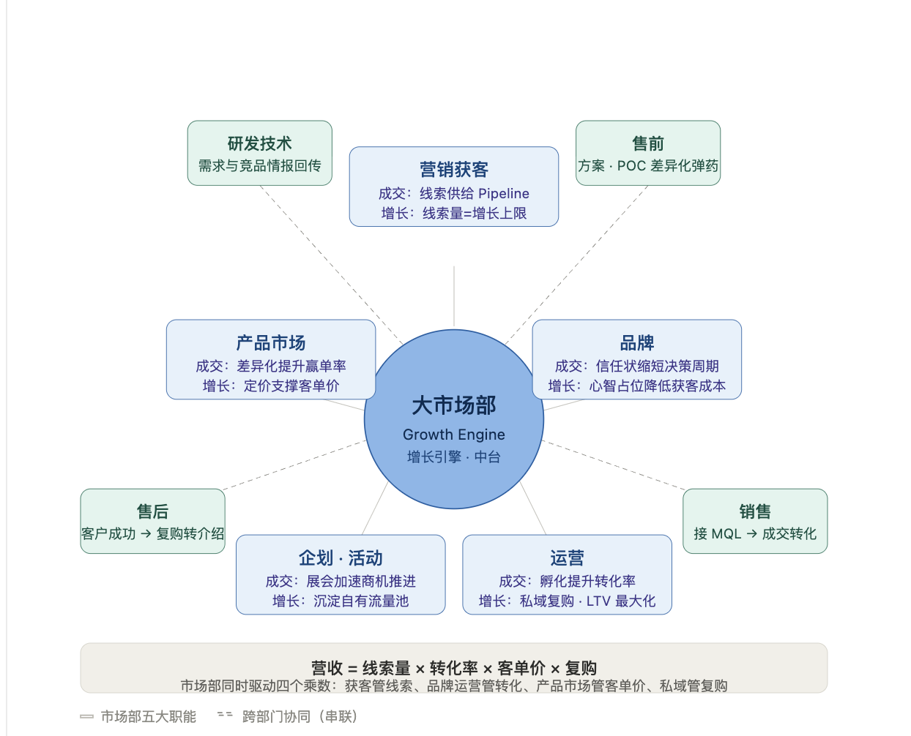
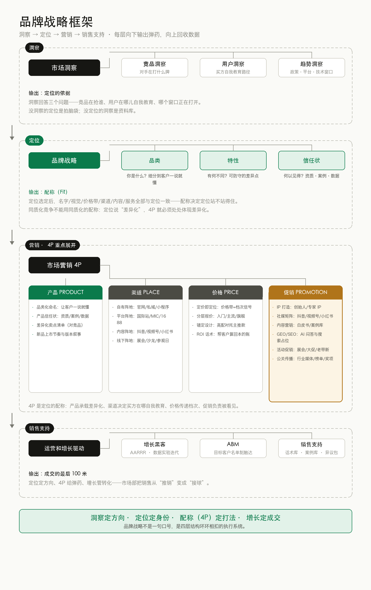

# B2B同质化市场营销_代运营提案

# 面向B2B 同质化竞争的市场营销服务

MARKETING OPERATIONS PROPOSAL · 2026 v2.0

---

## 02 · *Philip Kotler《Marketing 4.0》(2017)；*

## 科特勒《营销 4.0》

### 用户在数字世界完成自我教育，然后才选择品牌——销售介入时，采购旅程往往已走完大半

> **用户在数字的世界完成自我教育，然后选择品牌。**
—— 菲利普·科特勒《Marketing 4.0：从传统到数字》

> **用户不再区分线上和线下。**
—— 全渠道时代，旅程是一条连续的线

**营销范式的四次迁移：**

- **1.0 产品中心**：工业化大规模生产，比拼供给稀缺
- **2.0 客户导向**：细分与定位，比拼差异化
- **3.0 价值观驱动**：使命与意义，比拼认同
- **4.0 自我教育**：买方先完成研究再接触销售，比拼**可被发现性与可验证性**

**对 B2B 企业的三个推论：**

- 买方不是"被说服"，而是**"自己想明白"**——营销的任务是供给他想明白的材料
- 线上与线下边界消失——搜索、社媒、展会、拜访是同一条旅程的不同片段
- 看不见的地方正在决定看得见的成交——A1–A3 阶段的无声比较先筛掉了大多数人

## 03. CEB/Gartner B2B Buyer Journey 研究

## 营销对于成交的意义

|阶段|名称|含义|
|---|---|---|
|A1|了解|被动接触品牌信息|
|A2|吸引|产生兴趣与好感|
|**A3**|判断|**搜索·比较·验证——自我教育主战场**|
|A4|行动|下单·签约（传统销售介入点）|
|A5|拥护|复购·推荐|

- A1–A3：数字内容主导，销售尚未介入

- A4：传统销售介入点

**对 B2B 的含义：** 据 CEB/Gartner 对 B2B 采购的研究，买方在首次联系销售人员之前，已独立完成采购流程约 **57%**；采购委员会平均 **6–10** 人。他们在 A1–A3 阶段搜索、比较、验证的内容，决定了 A4 谁被列入候选名单。

**采购委员会：6–10 人的集体决策**

- **发起者**：一线使用者，最先感知痛点、发起立项
- **影响者**：技术 / 财务，各自用不同标准打分
- **决策者**：掌握预算的最终拍板人
- **把关者**：控制信息流入，决定谁能进场
- **采购者**：执行商务谈判与签约

同一份内容要同时回答六种人的六种疑问——这是 B2B 内容比 B2C 复杂的根源。

**营销漏斗：57% 意味着什么**

- **意识** → 触达：行业内容、展会、社媒——被动种草
- **研究** → 搜索：官网、白皮书、案例——主动验证
- **比较** → 短名单：竞品对比、第三方口碑——隐性淘汰
- **购买** → 销售：进入 A4，此时名单已定
- **拥护** → 复购推荐：客户案例反哺漏斗顶端

前 57% 的旅程里没有销售在场——缺席那段旅程的品牌，根本进不了后面的名单。

---

## 04. 完整的市场职能

### 大市场部：企业的增长引擎与中台

五大职能覆盖成交与增长两条线，并与研发、售前、售后、销售跨部门协同：

- **研发技术**：需求与竞品情报回传
- **营销获客**：线索供给 / 增长上限
- **售前**：方案 · POC 差异化弹药
- **产品市场**：差异化赢单率 / 定价支撑
- **品牌**：信任状缩短决策 / 心智降获客成本
- **售后**：客户成功 → 复购转介绍
- **企划·活动**：展会加速商机 / 沉淀自有流量池
- **运营**：孵化提升转化 / 私域复购 · LTV
- **销售**：接 MQL → 成交转化

**市场部 = 成交的"无形销售" + 增长的"复利资产"** ——五大职能覆盖买方旅程全程：A1–A3 阶段买方自我教育的内容供给，A4 阶段销售的差异化弹药，A5 阶段复购与转介绍的私域运营。

---

## 05 · 客户的现状

### 年度复盘的真相：每个部门都在更努力地做昨天的事

当所有人都因内卷感到疲惫和困惑，复盘给出的答案仍是"加倍投入"：

|部门|年度复盘的动作|主要内耗|
|---|---|---|
|销售|用更努力的拜访、更勤的跟进，寻找增量|操作服务不好 技术不够领先|
|市场|坚持投入、扩大合作，预算逐年加码|销售转化太差 技术不够领先|
|运营|继续想办法提高人效，压缩单位成本|销售不遵守规则 谈的都是亏本业务|
|技术|继续钻研热爱的方向，堆叠产品能力|销售不识货 谈的都是亏本业务|

> **越做越好的事情越会被重复，组织最终被锁死在过时的能力里。**
—— 能力陷阱（Competence Trap），Levitt & March, 1988

> **组织倾向在"邻近的、熟悉的、曾成功的"时空范围内取样学习。**
—— 短视学习（Myopia of Learning），Levinthal & March, 1993

**更努力解决的是"强度"问题；买方行为已经迁移，需要解决的是"方向"问题。** 四个部门都在既有路径上优化，而买方的自我教育早已发生在既有路径覆盖不到的地方。这正是外部营销框架介入的价值：不带历史包袱，从买方旅程倒推资源应该投在哪里。

**探索式利用：组织学习理论的核心框架**

- **利用（Exploitation）**：把既有能力做精——提效、降本、标准化，回报确定但递减
- **探索（Exploration）**：寻找新路径——新渠道、新品类、新内容形态，回报不确定但可能跳跃
- 四个部门的复盘全落在"利用"一侧——**组织在系统性缺席"探索"**
- 内卷的本质：利用的边际收益递减后，靠加大强度维持增速

**为什么外部框架能打破僵局**

- **无历史包袱**：不受"过去靠什么成功"的路径约束，能客观评估新路径
- **跨行业样本**：见过同类问题在不同行业的解法，避免本行业的集体盲区
- **从买方倒推**：以买方旅程为锚重新分配资源，而非以组织惯性为锚
- 外部视角的价值不是"更聪明"，而是**不被内部的沉没成本绑架**

*来源：T. Levitt & J. March (1988), Organizational Learning；D. Levinthal & J. March (1993), The Myopia of Learning*

---

## 05 · 我们的来时路

### 我们从产业互联网一线来：撮合平台最大的流量增量，来自抖音和视频号

linker.net 服务过的化工产业客户：

- 🔴 **中国化学-齐翔腾达**
- 🔵 **中国化学-天辰耀隆**
- 🟣 **东华天业**
- 🟢 **福建申远**
- 🔴 **上海华谊**
- 🔵 **宁波金发**

**一线观察，也是我们转向的起点：**
在服务这些化工撮合平台的过程中，我们发现大多数平台，即使是B2B大型撮合平台都在通过视频号、抖音获取流量。2019 年前后，平台上最大的流量增量来自抖音。

各垂直行业重演——15 个活跃的产业互联网平台：

|平台|行业|
|---|---|
|俺搜|化工|
|我要测|检测|
|找钢网|钢铁|
|欧冶云商|钢铁|
|国联股份·多多系|产业带|
|化塑汇|化工|
|快塑网|塑料|
|摩贝|化工|
|震坤行|工业品|
|锐锢商城|工业品|
|慧聪网|综合|
|锦桥纺织网|纺织|
|找塑料|塑料|
|我的塑料网|塑料|
|中国制造网|跨境|

---

## 06 · 流量密码：电商平台的本质是流量二批商

### 平台通过会员费收入购买流量，1元钱成本的流量兑水 13–260 倍的会员费收入。

按公开财报及投放数据估算：

|平台|年流量采购成本（估）|会员费+广告收入（扣佣金后）|流量价差倍数|
|---|---|---|---|
|**Made-in-China**|约 1.2 亿（Google 采购 0.8–1.0 亿 + 品牌广告 0.36 亿）|16.01 亿（基本无交易佣金）|**13–16x**|
|**Alibaba.com 国际站**|3–7 亿（集团 Google 投放 $3–10 亿 × 国际站分摊 15–20%）|约 259–261 亿（264.39 亿 − 信保佣金 3–5 亿）|**37–87x**|
|**1688**|<1 亿（淘系免费导流 + 自然流量为主）|约 260 亿（佣金极低）|**>260x**|

**平台流量机制：**

你缴会员费（获取"线上身份"）→ 平台采购流量（Google / 品牌广告）→ 汇入平台流量池（统一分配）→ 分配 + 让你竞价（再收一遍广告费）

- **规则一**：平台收费后，从它自己的流量池里分你一份——然后让你和别人竞价。位置越好，加价越多。

- **规则二**：有时池子里没有现成流量，就看你自己能不能做出来——这个窗口叫"红利期"。红利属于先做内容的人，之后变回竞价。

- **规则三**：你的会员费更多用于平台给自己推广。Made-in-China 最大的流量来源，是它自己的品牌词——你在替平台买它自己的名字。

### 那你一年到底要花多少？——卖家真实年投入

|投入档位|Alibaba.com 国际站|Made-in-China|年投入合计（区间）|
|---|---|---|---|
|**入门档**（刚起步/测试期）|出口通 2.98 万 + 直通车首充 1 万（P4P 起充 1 万，不可省）|金牌会员 3.11 万（基础广告另计）|**12.0 – 15 万**|
|**主流档**（多数活跃卖家实际状态）|出口通 AI 版 3.58 万 + 广告 3 万|钻石会员 5.98 万 + 固定排名词 0.4–1.6 万/词|**20 – 25 万**|
|**进阶档**（规模投放）|金品诚企 8–9 万 + 广告 5 万+|钻石会员 + 多词固定排名 + 数据管家 0.36 万|**36 – 45 万+**|
|**头部档**|行业领袖 PRO 50 万起|——|**100 万+**|

交叉验证：焦点科技 2024 年报——中国制造网付费会员 27,415 位、平台收入 13.56 亿，**单会员年均贡献（ARPPU）5.21 万元**；2025 年升至约 5.37 万。也就是说，MIC 的"平均客户"一年交给平台 5 万多，还不含站外 Google 投放与人力。

### 第 1、2 年能否回本？——三档情景测算

|情景|年投入|询盘量（行业经验值）|成交假设|首年毛利|结论|
|---|---|---|---|---|---|
|**悲观**（冷启动慢/竞争激烈类目）|6.6 万|150 条（约 12–13 条/月）|3% × $8,500 客单（4–5 单）|约 1.7 万（毛利率 10% 口径）|**第 1 年亏损 4.9 万**，第 2 年复购拉平，约 2.5–3 年回本|
|**中性**（行业平均水平）|8.6 万|300 条|4.6% × $8,500（约 14 单）|约 8.4 万（毛利率 20% 口径）|**第 1 年基本打平**，第 2 年复购后净赚，整体 2 年回本|
|**乐观**（优质运营/爆品类的 10–20%）|13 万|600+ 条|5% × $8,500+（30 单+）|约 25 万+（官方口径 ROI 1:4.3）|**第 1 年即回本**，第 2 年利润释放|

> **对多数卖家：平台投入 6.6–13 万/年，行业平均约 2 年回本，仅 10–20% 的优质运营首年回本。** 而且回本的前提是持续投入——直通车一停，询盘即降。这正是"流量租用"与"流量自有"的分水岭：同样的钱，第 1 年买询盘，第 3 年还在买询盘；换成内容资产，第 1 年投入，第 3 年复利。

**结构性结论：在二批商模式下，你的获客成本永远随竞价上涨；会员费只是门票，广告费才是无底洞。** 拥有自己的内容流量，等于绕过二批商，直接向一级市场进货。

*来源：焦点科技 2024/2025 年报（ARPPU 5.21–5.37 万、付费会员 27,415–29,793 位）；阿里巴巴国际站 2025 公开价目（出口通 2.98 万 / AI 版 3.58 万 / 金品 8–9 万）；MIC 会员价目（金牌 3.11 万 / 钻石 5.98 万）；询盘量与成交率为行业经验假设，供决策参考*

---

## 07 · 流量决策

### 渠道没有绝对好坏：客单价与成交率不同，同一渠道的 ROI 相差百倍

测算基准：Google 单询盘成本 $85.63，统一假设：

|客单价|Google 单询盘成本|成交率假设|Google ROI（首单）|TikTok 可持续 ROI|
|---|---|---|---|---|
|$500|$85.63|2%|0.13x（纯人工跟单）/ 3–4x（自动报价+复购）|1.2x|
|$5,000|$85.63|4–5%|2.5x / LTV 6–8x|5–6x|
|$20,000|$85.63|5%|12.6x / LTV 50–80x|**20–30x**|

**三条决策规则：**

1. **低客单 + 人工跟单 = 付费搜索亏损结构**，先改成交方式再谈投放

2. **复购与 LTV 决定预算上限**，单看首单 ROI 会错杀渠道

3. **"选什么渠道、付不付费"没有通用答案**，只能用你自己的客单价、成交率、复购结构算出来——这正是下一页框架要解决的问题

**单位经济学：一张表算清一个渠道**

- **CAC**（获客成本）= 渠道总投入 ÷ 新成交客户数
- **LTV**（客户终身价值）= 客单价 × 毛利率 × 复购次数 + 转介绍折算
- **LTV / CAC ≥ 3**：渠道健康，可加预算
- **LTV / CAC < 1**：越投放越亏，先改产品与转化，再谈渠道
- 回本周期 = CAC ÷ 单客户月均毛利——决定现金流能撑几个渠道

**渠道组合：租来的 vs 自有的**

- **租用流量**（平台会员、竞价广告）：见效快、随竞价涨价、停投即断
- **自有流量**（内容资产、私域、品牌搜索）：见效慢、边际成本递减、复利
- 健康结构 = **租用打现金牛 + 自有建护城河**，比例随行业周期调整
- 判断标准：若停掉某渠道投放，3 个月内询盘掉七成——那是租的，不是你的

*来源：内部测算模型；Google 询盘成本取行业均值 $85.63，成交率为分档假设，供决策参考*

---

## 08 · 我们的框架

### 线上线下一个漏斗：从买方自我教育到成交复购的全链路设计

**线上引擎打认知，线下引擎建信任，交汇层完成转化**

|线上引擎 · 内容与流量|交汇 · 信任与转化|线下引擎 · 关系与体验|
|---|---|---|
|**内容矩阵**：短视频 / 直播 / 白皮书 / 案例库|**线索孵化**：内容触达 → 留资 → 分层|**行业展会**：参展 / 演讲 / 获客名单|
|**搜索占位**：SEO / GEO（AI 问答）/ 官网|**商机确认**：销售在线上线索中接手跟进|**上门拜访**：大客户关键人触达|
|**私域沉淀**：企微 / 邮件 / 社群 / 直播间|**成交与交付**：方案 → 报价 → 签约|**客户参观**：工厂 / 实验室参观日|

**数据回流** → 内容迭代 → 渠道预算再分配 → 回到全链路目标（每月复盘校准一次）

**框架的用处：** 线上引擎影响买方的"自我教育"（A1–A3），线下引擎完成"关系与信任"（A4–A5），交汇层让两条线共享同一个线索池与数据看板——每季度用回流数据重新分配预算，而非按去年惯性续费。

**漏斗 vs 飞轮：两条线怎么咬合**

- **漏斗逻辑**（线上）：内容 → 触达 → 留资 → 商机 → 成交，逐层收窄、可量化
- **飞轮逻辑**（线下+私域）：成交 → 交付体验 → 案例与口碑 → 反哺漏斗顶端的内容资产
- 两条线在交汇层共享线索池——**线上产出的线索由线下关系承接，线下触达的客户被线上内容持续孵化**

**线索生命周期：从 MQL 到转介绍**

- **触达** → 留资（内容下载/表单/加微）
- **MQL** 市场合格线索：有预算迹象 + 匹配画像
- **SQL** 销售合格线索：确认需求、时间窗、决策人
- **商机** → 方案报价 → 签约交付
- **客户** → 案例沉淀 → 转介绍新线索——回到起点

---

## 09 · 市面上的方案各管一段

### 获客的不管转化，做转化的不算利润，利润不管口碑，口碑不管增长

**市面上的方案：**

- 执着推介一个渠道——"你该做抖音""你该投 Google Ads"
- 解决获客的，不解决转化——询盘交到你手上就算交付
- 解决转化的，不考虑利润——GMV 做起来了，账算不过来
- 渠道商的利益决定建议：卖什么，就推荐你买什么

**我们提供的：**

- 整个市场营销的**体系框架**——先看全链路，再决定投不投、投哪个
- 每个选择的**价格与方法论**——用你的客单价、成交率、复购结构算清账
- 对结果负责的边界清晰：线索、转化、利润逐层约定
- 立场中立——框架里没有必须卖的渠道

> **"如何决策哪个渠道适合你"——这个问题本身，就是一个关键问题。** 我们提供选择的框架、价格和方法论；先决策，再投放，最后才谈优化。

---

## 10 · 我们的专注

### 我们专门解决 B2B 同质化市场营销。同质化的竞争，不能用同质化的内容。

当产品、价格、服务在买方眼中难以区分时，内容还在用同一套行业话术——"品质保障、服务至上、价格优惠"——等于在同质化之上再叠一层同质化。破局从内容的差异化开始，而内容的差异化来自产品的差异化。

定位理论（Ries & Trout）：竞争的终极单位不是产品，是心智——买方心智中每个品类只给少数品牌留位置。差异化不是"说不同的话"，是**找到"你有而对手没有"的那个事实**，再把它翻译到买方自我教育的路径上。

---

## 11 · 方法论框架

### 品牌战略框架：洞察 → 定位 → 营销 → 销售支持

**每层向下输出弹药，向上回收数据**

**【洞察层】市场洞察**
- 竞品洞察：对手在打什么牌
- 用户洞察：买方自我教育路径
- 趋势洞察：政策 · 平台 · 技术窗口
- 输出：定位的依据——竞品在抢谁、用户在哪儿自我教育、哪个窗口正在打开

**【定位层】品牌战略**
- 品类：你是什么？一说就懂
- 特性：有何不同？可防守的差异点
- 信任状：何以见得？资质 · 案例 · 数据
- 输出：配称（Fit）——名字/视觉/价格带/渠道/内容全部与定位一致

**【营销层】市场营销 4P**

| 产品 PRODUCT | 渠道 PLACE | 价格 PRICE | 促销 PROMOTION |
|---|---|---|---|
| 品类化命名 | 自有：官网/私域 | 定价即定位 | IP 打造 |
| 产品信任状 | 平台：国际站/MIC/1688 | 分层报价 | 社媒矩阵 |
| 差异化卖点清单 | 内容：抖音/视频号 | 锚定设计 | 白皮书/案例库 |
| 新品节奏与叙事 | 线下：展会/参观日 | ROI 回本话术 | GEO/SEO 占位 |
| | | | 展会/大促/老带新 |
| | | | 媒体/榜单/奖项 |

4P 是定位的配称：产品承载差异化、渠道决定买方在哪自我教育、价格传递档次、促销负责被看见。

**【销售支持层】运营和增长驱动**
- 增长黑客：AARRR · 数据实验迭代
- ABM：目标客户名单制触达
- 销售支持：话术库 · 案例库 · 异议包
- 输出：成交的最后 100 米——定位定方向、4P 给弹药、增长管转化

**洞察定方向 · 定位定身份 · 配称（4P）定打法 · 增长定成交** ——品牌战略不是一句口号，是四层结构环环相扣的执行系统。

## 12· 核心方法论

### 同质化竞争还是要找到产品差异化，再把它翻译到买方的自我教育路径上

四步方法，每步都有明确交付物：

|步骤|内容|交付|
|---|---|---|
|**01 品类定义**|回答"你是什么"。把模糊的行业身份改写为具体品类——细分到客户一说就懂、竞品一时无法跟进|品类定位语|
|**02 特性占位**|回答"有何不同"。从客户真实的复购理由中提炼可防守的特性，而非自造形容词|差异化特性清单|
|**03 信任状**|回答"何以见得"。把资质、数据、案例从抽屉里拿出来，变成买方可感知、可验证的证据|信任状武器化方案|
|**04 内容放大**|把前三步的结果翻译到买方路径上：搜索、短视频、行业社区——出现在 A3"询问"发生的地方|内容矩阵与渠道计划|

**差异化先行，内容随后，渠道最后。** 多数代运营直接从第四步开始——在没有差异化的产品上投放同质化内容，预算越大，同质化越深。我们把顺序反过来：先找到"你有而对手没有"的那个事实，再决定怎么讲、在哪讲。

**品类三问的出处与分工**

- **你是什么**——品类定义（Category Definition）：源自定位学派"品类是心智的抽屉"，买方按品类检索记忆
- **有何不同**——差异化特性（Differentiation）：源自特劳特"与众不同"，必须可防守——竞品短期学不会、长期不愿学
- **何以见得**——信任状（Trust Marks）：源自"证明"环节，让差异化从"自称"变成"可验证"

**顺序为什么不能乱**

- **没有品类的差异化** = 无处安放的优点——买方不知道把你归到哪个抽屉
- **没有差异化的信任状** = 行业公地——竞品同样能出示的资质不构成优势
- **没有信任状的内容** = 自说自话——A3 阶段的买方要的是证据，不是形容词
- 三步齐备，第四步的投放才有转化率——**内容是差异化的翻译，不是差异化的替代**

*方法融合品类与定位理论（品类三问：你是什么 / 有何不同 / 何以见得）与买方旅程模型*

---

## 12 · 伙伴介绍

**杨烨 · 合伙人 Founder**

- 商竞咨询 前高级合伙人
- 上海链接者集团 前副总裁
- 为超过15家超大型企业，和75家各类中小企业提供品牌战略咨询和数字化营销服务落地
- 思科创投某物联网高科技企业中国区 MD
- 雀巢管培，糖果产品市场经理
- 持有物联网、互联网技术多项国家专利

**陈默默 · 合伙人 Co-founder**

- 元璟资本 前投资副总裁；现任某美元基金投资的头部 AI 玩具公司 CMO
- 主导/参与投资：探探、每日优鲜、二更、只二、超级零、鲲游光电等
- 猎云网 2019「年度新生代投资人 TOP30」；曾任 LVMH 管培
- 复旦大学电子工程学士、中欧国际工商学院 MBA
- 消费品牌增长方法论，创始人

**罗敏 · 合伙人 Co-founder**

- 商竞咨询 前高级合伙人
- 深圳前海柔宇科技 前CMO
- 品牌营销从业 20 年，横跨 IT、汽车、医药、金融、快消多行业
- 中国公共关系行业史上首个互联网营销金奖获得者；SABRE Awards 全球金奖（中国公司首个）
- 著有《场景连接一切》（电子工业出版社，2018）；持有大数据与软件系统集成两项专利
- 工信部"品牌万里行"特约讲师，主讲 B2B 战略营销与场景营销

---

## 13 · 伙伴介绍

**石洪洋 · 运营主管**

- 熟悉南派、北派代运营公司的风格差异，精通对各层级运营人员的培训和管理
- 擅长管理百人规模运营大项目，并能保持团队较好的内部氛围

**兰贵东 · 技术产品经理**

- 密码学专业
- 宝信后端程序员（资深）
- 央国企到民企的全谱系客户技术服务经验
